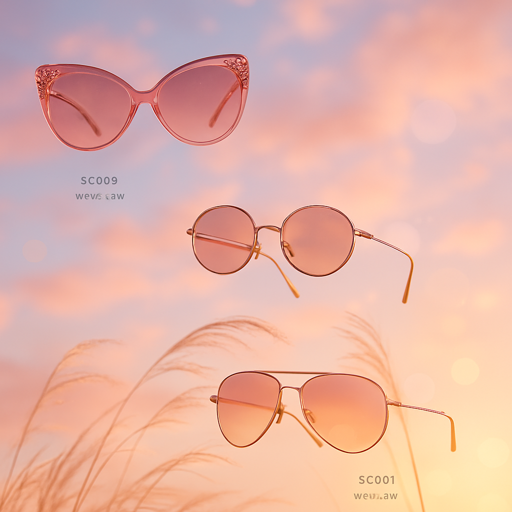

# 🕶️ Summer Sunglasses Campaign – Executive Summary

## 📊 Refined Trend Insights
Executive Summary: Summer 2026 Eyewear Campaign

Date: May 14, 2026

Objective  
Present a concise roadmap for leveraging three dominant eyewear trends—rectangular acetate, performance wraparounds, and feminine cat-eye—to maximize market impact this summer.

1. Market Trends  
• Rectangular Acetate Frames  
  – Glossy black or tortoise finishes, flat-top silhouette, precise proportions  
  – Versatile, modern reinterpretation of a classic shape  
• Performance-Minded Wraparounds  
  – Single- or curved-lens designs, rubber grips, ultralight materials  
  – Blends athletic functionality with a sleek, futuristic aesthetic  
• Feminine Cat-Eye/Butterfly Frames (Supporting)  
  – Upswept corners, delicate curves, subtle ’50s-inspired details  
  – Adds romantic nostalgia and elevated glamour

2. Product Alignment  
• Wayfarer (SG002)  
  – Thick acetate, structured flat-top profile  
  – Perfect match for the rectangular-frame trend  
  – Available: 6 units  
• Sport (SG004)  
  – Wraparound lens, rubberized temples, feather-light frame  
  – Ideal for active, style-conscious consumers  
  – Available: 11 units  
• Mystique (SG003)  
  – Feminine cat-eye silhouette with refined curves  
  – Nods to retro glamour as a premium option  
  – Available: 3 units

3. Campaign Strategy  
• Core Styles: Position Wayfarer and Sport as flagship offerings to capture broad appeal—everyday versatility and “performance as fashion.”  
• Premium Accent: Feature Mystique in targeted digital and in-store activations to engage trendsetters seeking nostalgic luxury.  
• Messaging Pillars: Emphasize on-trend silhouettes, functional innovation, and a touch of vintage allure.

By centering our Summer 2026 campaign on these curated styles, we address today’s consumer demand for modern classics, high-performance design, and nostalgic sophistication—driving both volume sales and brand prestige.

## 🎯 Campaign Visual

    

## ✍️ Campaign Quote
United in Summer: Timeless, Athletic, Romantic

## ✅ Why This Works
The image presents three silhouettes—each woman embodying a core Summer 2026 eyewear trend: the classic rectangular acetate (‘Timeless’), the performance wraparound (‘Athletic’), and the feminine cat-eye (‘Romantic’)—united in a single, sunlit moment.

---

*Report generated on 2026-05-14*
